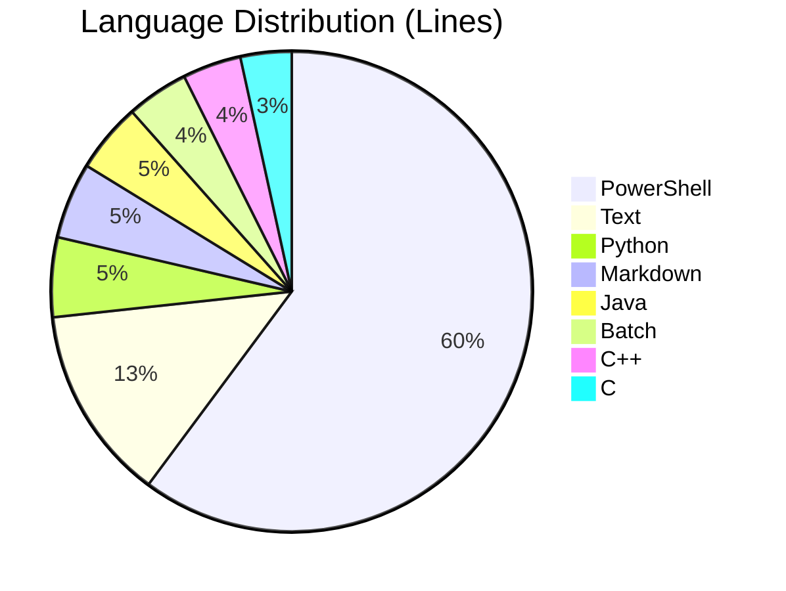
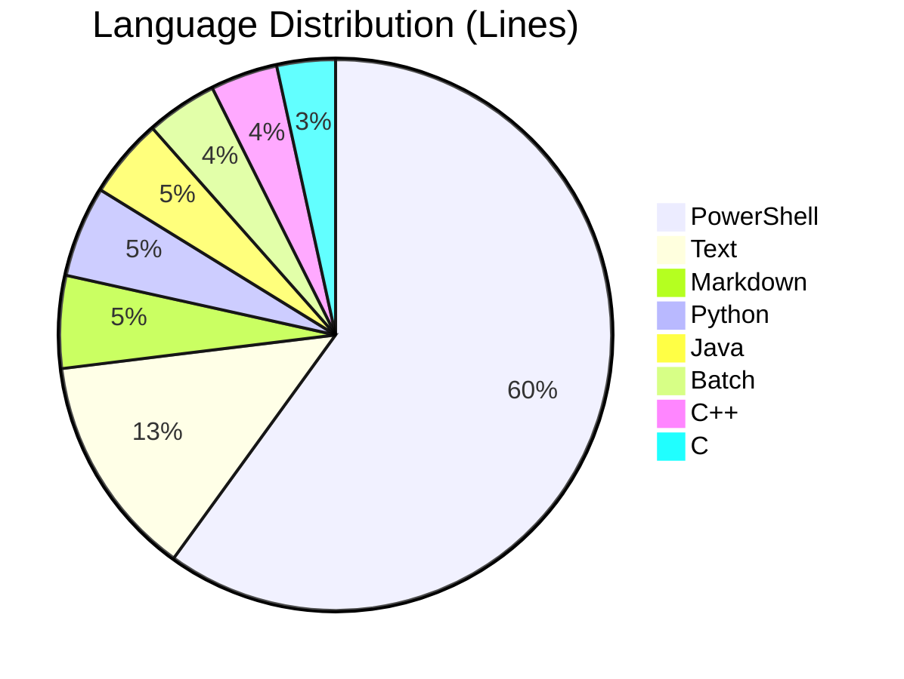
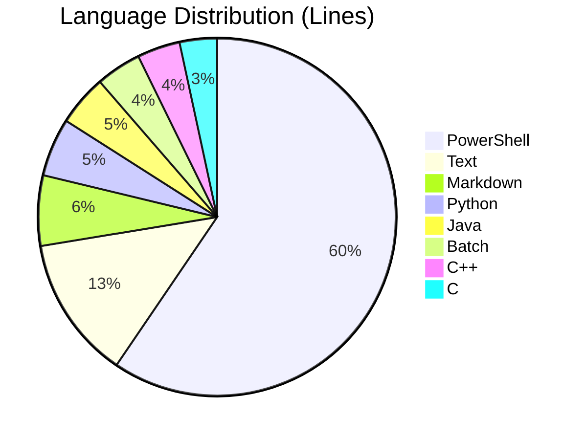
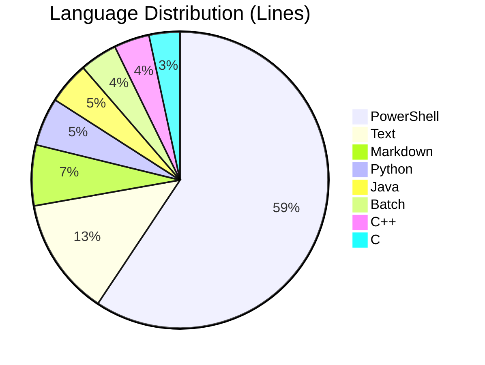

# 📊 Project Statistics & Insights

> "Data beats opinion."

| Timestamp | Total Lines | Code vs Comments | 🌲 Paper Estimate |
|---|---|---|---|
| 2026-01-05 06:12:53 | **14,188** | 73.1% / 9.9% | 284 pages |

<strong>📈 Deep Dive: 2026-01-05 06:12:53 (Visuals included)</strong>

### 🥧 Language Breakdown

### 🏗️ Physical & Fun Metrics
| Metric | Value | Context |
|---|---|---|
| **Stack Height** | 2.84 cm | Height if printed on A4 paper |
| **Typing Time** | 29.6 hours | Pure typing time (no thinking!) at 40 WPM |
| **Tree Cost** | 0.0341 trees | Environmental impact of printing this |
| **Avg File Size** | 232 lines | Complexity indicator |

### 🏆 Largest Files (The Monoliths)
| Rank | File | Lines |
|---|---|---|
| 1 | `scripts\d1run-impl.ps1` | **2,256** |
| 2 | `logs\installation-log.txt` | **1,808** |
| 3 | `scripts\install-dev-environment.ps1` | **951** |
| 4 | `scripts\auto-push-monitor\auto-push-monitor.ps1` | **767** |
| 5 | `scripts\credentials-manager.ps1` | **683** |

---
| 2026-01-05 06:13:34 | **14,232** | 73.1% / 9.9% | 285 pages |

<strong>📈 Deep Dive: 2026-01-05 06:13:34 (Visuals included)</strong>

### 🥧 Language Breakdown

### 🏗️ Physical & Fun Metrics
| Metric | Value | Context |
|---|---|---|
| **Stack Height** | 2.85 cm | Height if printed on A4 paper |
| **Typing Time** | 29.6 hours | Pure typing time (no thinking!) at 40 WPM |
| **Tree Cost** | 0.0342 trees | Environmental impact of printing this |
| **Avg File Size** | 229 lines | Complexity indicator |

### 🏆 Largest Files (The Monoliths)
| Rank | File | Lines |
|---|---|---|
| 1 | `scripts\d1run-impl.ps1` | **2,256** |
| 2 | `logs\installation-log.txt` | **1,808** |
| 3 | `scripts\install-dev-environment.ps1` | **951** |
| 4 | `scripts\auto-push-monitor\auto-push-monitor.ps1` | **767** |
| 5 | `scripts\credentials-manager.ps1` | **683** |

---
| 2026-01-05 06:29:36 | **14,422** | 73.1% / 9.8% | 289 pages |

<strong>📈 Deep Dive: 2026-01-05 06:29:36 (Visuals included)</strong>

### 🥧 Language Breakdown

### 🏗️ Physical & Fun Metrics
| Metric | Value | Context |
|---|---|---|
| **Stack Height** | 2.89 cm | Height if printed on A4 paper |
| **Typing Time** | 30.0 hours | Pure typing time (no thinking!) at 40 WPM |
| **Tree Cost** | 0.0347 trees | Environmental impact of printing this |
| **Avg File Size** | 228 lines | Complexity indicator |

### 🏆 Largest Files (The Monoliths)
| Rank | File | Lines |
|---|---|---|
| 1 | `scripts\d1run-impl.ps1` | **2,256** |
| 2 | `logs\installation-log.txt` | **1,808** |
| 3 | `scripts\install-dev-environment.ps1` | **951** |
| 4 | `scripts\auto-push-monitor\auto-push-monitor.ps1` | **802** |
| 5 | `scripts\credentials-manager.ps1` | **683** |

---
| 2026-01-05 06:33:28 | **14,460** | 73.1% / 9.8% | 290 pages |

<strong>📈 Deep Dive: 2026-01-05 06:33:28 (Visuals included)</strong>

### 🥧 Language Breakdown

### 🏗️ Physical & Fun Metrics
| Metric | Value | Context |
|---|---|---|
| **Stack Height** | 2.9 cm | Height if printed on A4 paper |
| **Typing Time** | 30.1 hours | Pure typing time (no thinking!) at 40 WPM |
| **Tree Cost** | 0.0348 trees | Environmental impact of printing this |
| **Avg File Size** | 229 lines | Complexity indicator |

### 🏆 Largest Files (The Monoliths)
| Rank | File | Lines |
|---|---|---|
| 1 | `scripts\d1run-impl.ps1` | **2,256** |
| 2 | `logs\installation-log.txt` | **1,808** |
| 3 | `scripts\install-dev-environment.ps1` | **951** |
| 4 | `scripts\auto-push-monitor\auto-push-monitor.ps1` | **802** |
| 5 | `scripts\credentials-manager.ps1` | **683** |

---
